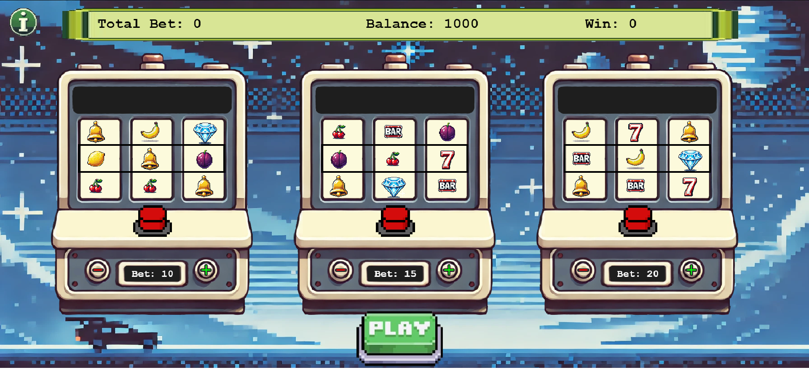
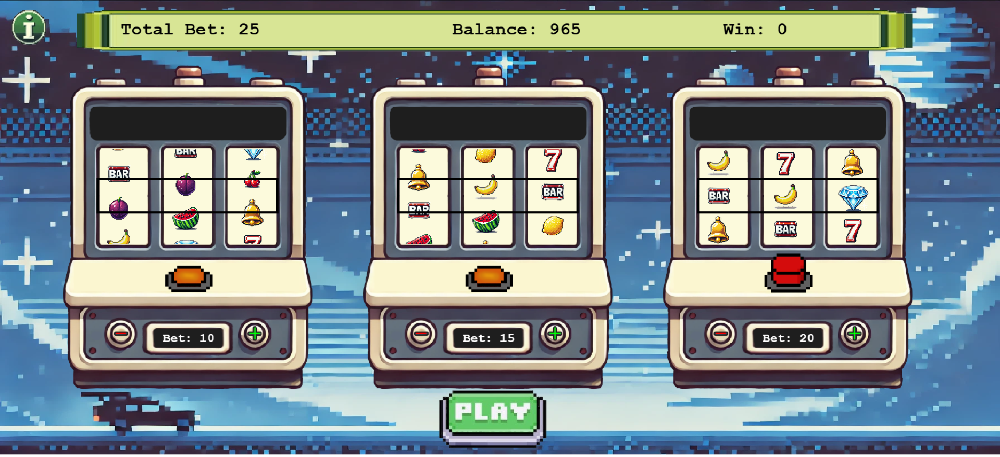
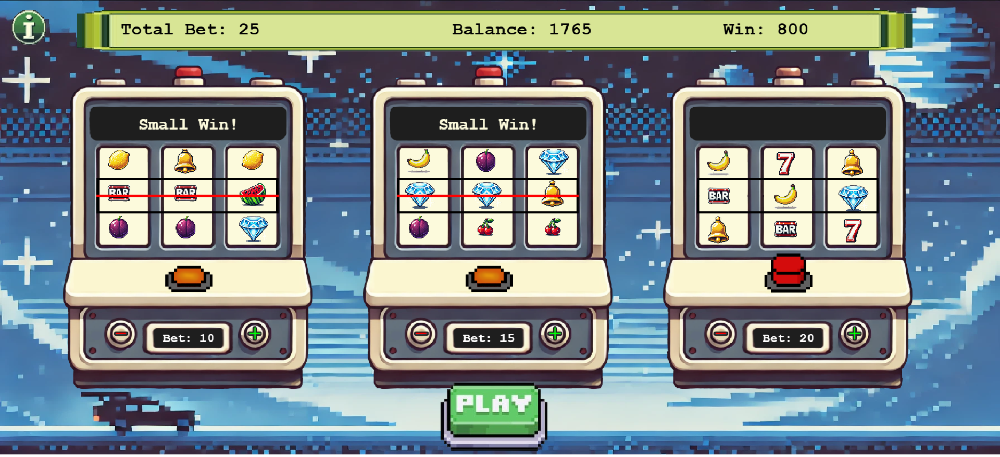
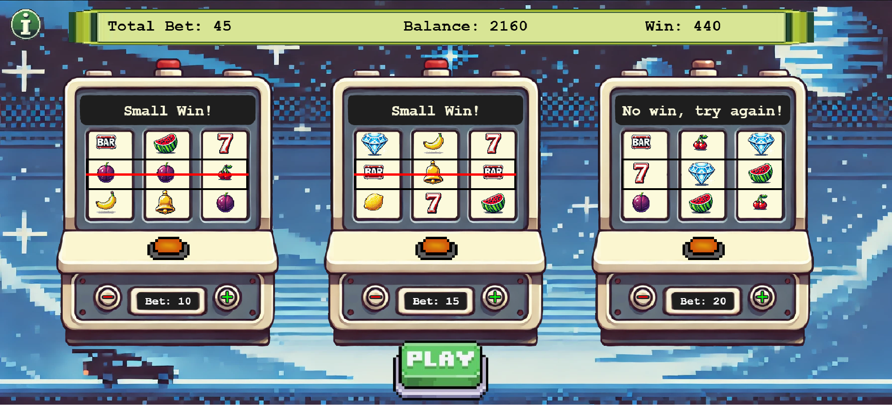

Реалізація веб-застосунку "Однорукий бандит" за допомогою Phaser.js та Wampserver. 

Три одноруких бандити стоять у ряд, і кожен автомат має свою ймовірність виграшу від чого й залежить сума виграшу. 

Гравець може запустити будь-якого з них або кілька одночасно одним натисканням, після чого барабани крутяться та зупиняються послідовно протягом 4-5 секунд. 

Результат гри (виграш чи програш) повідомляється через пуш-сповіщення, а також враховується у механіці рахунку. 

Проєкт було реалізовано в команді: До Данг Ха Мі (MashaDoDang), Меліка Марія (mashenka2277), Шишка Ольга (o-shysha), Григорук Ольга (OlyaGrygoruk)
